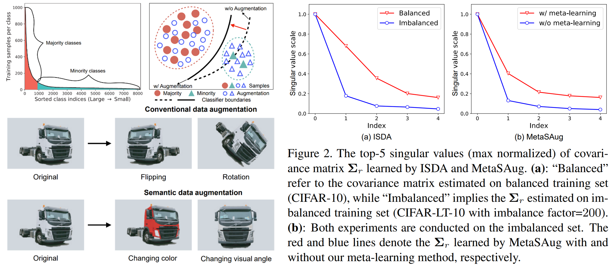

# MetaSAug: Meta Semantic Augmentation for Long-Tailed Visual Recognition

This repository contains the code for:

**MetaSAug: Meta Semantic Augmentation for Long-Tailed Visual Recognition**.

Shuang Li, Kaixiong Gong, et al.

IEEE/CVF Conference on Computer Vision and Pattern Recognition (CVPR). 2021. [[arXiv](https://arxiv.org/abs/2103.12579)]  [[pdf](https://openaccess.thecvf.com/content/CVPR2021/papers/Li_MetaSAug_Meta_Semantic_Augmentation_for_Long-Tailed_Visual_Recognition_CVPR_2021_paper.pdf)]

#### Abstract

Real-world training data usually exhibits long-tailed distribution, where several majority classes have a significantly larger number of samples than the remaining minority classes. This imbalance degrades the performance of typical supervised learning algorithms designed for balanced training sets. In this paper, we address this issue by augmenting minority classes with a recently proposed implicit semantic data augmentation (ISDA) algorithm, which produces diversified augmented samples by translating deep features along many semantically meaningful directions. Importantly, given that ISDA estimates the classconditional statistics to obtain semantic directions, we find it ineffective to do this on minority classes due to the insufficient training data. To this end, we propose a novel approach to learn transformed semantic directions with metalearning automatically. In specific, the augmentation strategy during training is dynamically optimized, aiming to minimize the loss on a small balanced validation set, which is approximated via a meta update step. Extensive empirical results on CIFAR-LT-10/100, ImageNet-LT, and iNaturalist2017/2018 validate the effectiveness of our method

<p align="center">

</p>  
 

If you find this idea or code useful for your research, please consider citing our paper:
```
@inproceedings{li2021metasaug,
  title={Metasaug: Meta semantic augmentation for long-tailed visual recognition},
  author={Li, Shuang and Gong, Kaixiong and Liu, Chi Harold and Wang, Yulin and Qiao, Feng and Cheng, Xinjing},
  booktitle={Proceedings of the IEEE/CVF Conference on Computer Vision and Pattern Recognition},
  pages={5212--5221},
  year={2021}
}
```

## Prerequisite

- PyTorch >= 1.2.0
- Python3
- torchvision
- PIL
- argparse
- numpy

## Evaluation

We provide several trained models of MetaSAug for evaluation.

Testing on CIFAR-LT-10/100:

- `sh scripts/MetaSAug_CE_test.sh`
- `sh scripts/MetaSAug_LDAM_test.sh`

Testing on ImageNet and iNaturalist18:

- `sh ImageNet_iNat/test.sh`

The trained models are in [Google Drive](https://drive.google.com/drive/folders/1YyE4RAniebDo8KyvdobcRfS0w5ZtMAQt?usp=sharing).

## Getting Started

### Dataset
- Long-tailed CIFAR10/100: The long-tailed version of CIFAR10/100. Code for coverting to long-tailed version is in [data_utils.py](https://github.com/BIT-DA/MetaSAug/blob/main/data_utils.py).
- ImageNet-LT: The long-tailed version of ImageNet. [[Long-tailed annotations](https://github.com/BIT-DA/MetaSAug/tree/main/ImageNet_iNat/data)]
- [iNaturalist2017](https://github.com/visipedia/inat_comp/tree/master/2017): A natural long-tailed dataset.
- [iNaturalist2018](https://github.com/visipedia/inat_comp/tree/master/2018): A natural long-tailed dataset.

### Training

Training on CIFAR-LT-10/100:
```
CIFAR-LT-100, MetaSAug with LDAM loss
python3.6 MetaSAug_LDAM_train.py --gpu 0 --lr 0.1 --lam 0.75 --imb_factor 0.05 --dataset cifar100 --num_classes 100 --save_name MetaSAug_cifar100_LDAM_imb0.05 --idx 1
```

Or run the script:

```
sh scripts/MetaSAug_LDAM_train.sh
```

Training on ImageNet-LT:

```
CUDA_VISIBLE_DEVICES=0,1,2,3 python3 -m torch.distributed.launch --nproc_per_node=4 --master_port 53212 train.py  --lr 0.0003 --meta_lr 0.1 --workers 0 --batch_size 256 --epochs 20 --dataset ImageNet_LT --num_classes 1000 --data_root ../ImageNet
```

Or run the script:

```
sh ImageNet_iNat/scripts/train.sh
```

**Note**: Training on large scale datasets like ImageNet-LT and iNaturalist2017/2018 involves multiple gpus for faster speed. To achieve better generalizable representations, vanilla CE loss is used for training the network in the early training stage. For convenience, the training starts from the pre-trained models, e.g., [ImageNet-LT](https://dl.fbaipublicfiles.com/classifier-balancing/ImageNet_LT/models/resnet50_uniform_e90.pth), [iNat18](https://dl.fbaipublicfiles.com/classifier-balancing/iNaturalist18/models/resnet50_uniform_e200.pth) (both from project [cRT](https://github.com/facebookresearch/classifier-balancing)).

## Results and models
**CIFAR-LT-10**
|   Model   | Imb.| Top-1 Error |   Download    |Model   | Imb.| Top-1 Error |   Download    |
| --------- |:--------:|:-----------:|:-------------:|--------- |:--------:|:-----------:|:-------------:|
| MetaSAug+LDAM | 200  |22.65 | [ResNet32](https://drive.google.com/drive/folders/1eKGWDXBa1jqOBWXRUVks6iZOn2YhKkET?usp=sharing) |MetaSAug+CE | 200  |23.11 | [ResNet32](https://drive.google.com/drive/folders/1eKGWDXBa1jqOBWXRUVks6iZOn2YhKkET?usp=sharing) |
| MetaSAug+LDAM | 100  |19.34 | [ResNet32](https://drive.google.com/drive/folders/1eKGWDXBa1jqOBWXRUVks6iZOn2YhKkET?usp=sharing) |MetaSAug+CE | 100  |19.46 | [ResNet32](https://drive.google.com/drive/folders/1eKGWDXBa1jqOBWXRUVks6iZOn2YhKkET?usp=sharing) |
| MetaSAug+LDAM | 50   |15.66 | [ResNet32](https://drive.google.com/drive/folders/1eKGWDXBa1jqOBWXRUVks6iZOn2YhKkET?usp=sharing) |MetaSAug+CE | 50  |15.97 | [ResNet32](https://drive.google.com/drive/folders/1eKGWDXBa1jqOBWXRUVks6iZOn2YhKkET?usp=sharing) |
| MetaSAug+LDAM | 20   |11.90 | [ResNet32](https://drive.google.com/drive/folders/1eKGWDXBa1jqOBWXRUVks6iZOn2YhKkET?usp=sharing) |MetaSAug+CE | 20  |12.36 | [ResNet32](https://drive.google.com/drive/folders/1eKGWDXBa1jqOBWXRUVks6iZOn2YhKkET?usp=sharing) |
| MetaSAug+LDAM | 10   |10.32 | [ResNet32](https://drive.google.com/drive/folders/1eKGWDXBa1jqOBWXRUVks6iZOn2YhKkET?usp=sharing) |MetaSAug+CE | 10  |10.56 | [ResNet32](https://drive.google.com/drive/folders/1eKGWDXBa1jqOBWXRUVks6iZOn2YhKkET?usp=sharing) |

**CIFAR-LT-100**
|   Model   | Imb.| Top-1 Error |   Download    |Model   | Imb.| Top-1 Error |   Download    |
| --------- |:--------:|:-----------:|:-------------:|--------- |:--------:|:-----------:|:-------------:|
| MetaSAug+LDAM | 200  |56.91 | [ResNet32](https://drive.google.com/drive/folders/1eKGWDXBa1jqOBWXRUVks6iZOn2YhKkET?usp=sharing) |MetaSAug+CE | 200  |60.06 | [ResNet32](https://drive.google.com/drive/folders/1eKGWDXBa1jqOBWXRUVks6iZOn2YhKkET?usp=sharing) |
| MetaSAug+LDAM | 100  |51.99 | [ResNet32](https://drive.google.com/drive/folders/1eKGWDXBa1jqOBWXRUVks6iZOn2YhKkET?usp=sharing) |MetaSAug+CE | 100  |53.13 | [ResNet32](https://drive.google.com/drive/folders/1eKGWDXBa1jqOBWXRUVks6iZOn2YhKkET?usp=sharing) |
| MetaSAug+LDAM | 50   |47.73 | [ResNet32](https://drive.google.com/drive/folders/1eKGWDXBa1jqOBWXRUVks6iZOn2YhKkET?usp=sharing) |MetaSAug+CE | 50  |48.10 | [ResNet32](https://drive.google.com/drive/folders/1eKGWDXBa1jqOBWXRUVks6iZOn2YhKkET?usp=sharing) |
| MetaSAug+LDAM | 20   |42.47 | [ResNet32](https://drive.google.com/drive/folders/1eKGWDXBa1jqOBWXRUVks6iZOn2YhKkET?usp=sharing) |MetaSAug+CE | 20  |42.15 | [ResNet32](https://drive.google.com/drive/folders/1eKGWDXBa1jqOBWXRUVks6iZOn2YhKkET?usp=sharing) |
| MetaSAug+LDAM | 10   |38.72 | [ResNet32](https://drive.google.com/drive/folders/1eKGWDXBa1jqOBWXRUVks6iZOn2YhKkET?usp=sharing) |MetaSAug+CE | 10  |38.27 | [ResNet32](https://drive.google.com/drive/folders/1eKGWDXBa1jqOBWXRUVks6iZOn2YhKkET?usp=sharing) |

**ImageNet-LT**
| Model | Top-1 Error| Download |
| --------- |:--------:|:-----------:|
| MetaSAug |  52.33  | [ResNet50](https://drive.google.com/drive/folders/1HuaMsPCcR4DV1Tev9dHxd4BGU7mxJuqZ?usp=sharing)|

**iNaturalist18**
| Model | Top-1 Error| Download |
| --------- |:--------:|:-----------:|
| MetaSAug |  30.50  | [ResNet50](https://drive.google.com/drive/folders/1yQDFKDQmgxWArHNc9kvEPxMPcs2mXa6O?usp=sharing)|

## Acknowledgements
Some codes in this project are adapted from [Meta-class-weight](https://github.com/abdullahjamal/Longtail_DA) and [cRT](https://github.com/facebookresearch/classifier-balancing). We thank them for their excellent projects.


